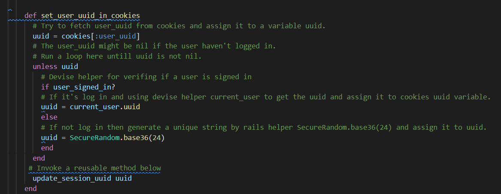

# Game Cabin

#### Author: Ben Chen
The master key is in docs folder
Completed as Term 2 Ruby on Rails assessment at [Coder Academy's](https://coderacademy.edu.au/) 2021 Fast track Bootcamp.

## Table of Contents
- [Game Cabin](#game-cabin)
      - [Author: Ben Chen](#author-ben-chen)
  - [Table of Contents](#table-of-contents)
  - [Local environment for testing](#local-environment-for-testing)
  - [Identify The Problem](#identify-the-problem)
      - [Background and Problem Identification](#background-and-problem-identification)
  - [Important Links](#important-links)
  - [Description](#description)
    - [Purpose](#purpose)
    - [Functionality and Features](#functionality-and-features)
    - [Screenshots](#screenshots)
    - [Target Audience](#target-audience)
  - [Tech stack](#tech-stack)
  - [User Stories](#user-stories)
  - [Wireframes](#wireframes)
  - [ERD Diagram](#erd-diagram)
  - [Components](#components)
    - [User](#user)
    - [Category](#category)
    - [Product](#product)
    - [Shopping Cart](#shopping-cart)
    - [Address](#address)
    - [Order](#order)
    - [Third Party Services](#third-party-services)
## Local environment for testing

    
Click to expand

* clone repository with `git clone git@github.com:bennychen2004181026/marketplace_assignment.git`
* navigate into app folder with `cd src/game_cabin`
* update config/credentials.yml with your variable AWS S3
* run `bundle install`
* run `sudo service postgresql start` or `sudo systemctl start postgresql`depending on the system
* run `rails db:setup`
* run `rails db:migrate`
* run `rails s`
* In a browser with typing `localhost:3000` to see the project.
* Game Cabin comes with three pre-initialized admin accounts: "super@test.com", "test@test.com", and "test1@test.com". The password for each is "11111111". Please log in with an admin account to set up product categories and subcategories for display on the homepage.

## Identify The Problem 

#### Background and Problem Identification

* Identification of the Problem Solved by this Marketplace App

During the COVID-19 pandemic, Australia experienced stringent lockdowns and border closures. This period saw a significant rise in gaming expenditure as individuals sought entertainment during extended home stays. Market analysis predicts the gaming industry in Australia to exceed $5 billion by 2025. This surge in gaming has led to an accumulation of games and consoles in homes, often going unused or becoming obsolete.

This scenario poses a unique challenge. On one hand, gamers continuously seek new experiences, leading to an excess of unused gaming items. On the other, budget-conscious gamers are in constant search of affordable options. This disparity in needs creates a market inefficiency that requires a solution.

* Why This Problem Needs a Solution

Enter the concept of a two-sided marketplace app, a perfect solution to bridge this gap. As the gaming market expands, consumer spending patterns evolve. Financial sustainability becomes a concern for gamers frequently investing in new games and consoles. A platform enabling them to sell items they no longer need addresses this issue. Simultaneously, it caters to those seeking more affordable gaming options.

Our app offers a dynamic platform where users can buy and sell pre-owned games and consoles, fostering a cycle of cost-effective gaming. It not only provides a solution for gamers to monetize their unused items but also enables others to access gaming experiences at lower costs. This continuous exchange maximizes the value derived from each gaming product, creating a more sustainable and enjoyable gaming ecosystem.

## Important Links

[Link to Github Repo](https://github.com/bennychen2004181026/marketplace_assignment)

[Link to deployed website](https://game-cabin-0f88fecc7027.herokuapp.com/)

 [Back to Table of Contents](#table-of-contents)

## Description
    
### Purpose

Game Cabin is an innovative online marketplace designed to facilitate the buying, selling, and trading of preowned games and consoles. Our platform caters to gaming enthusiasts looking for great deals and a community-driven trading experience.

### Functionality and Features

Game Cabin offers a suite of user-friendly features to enhance the buying and selling experience:

1. **User management**

* Access Control: Basic user management allows visitors to browse products and use the shopping cart without logging in. Features like product selling and checkout require user authentication for enhanced security.

* User Profile Management: Users can easily update their passwords or log out, maintaining control over their personal and security details.
   
1. **Selling management**
   
* Product Listing: Users can list their gaming items by providing essential details like images, names, availability status, quantity, price, and descriptions. This information is then visible to all users for browsing and purchasing.

* Item Control: Sellers have the ability to edit or delete their listings, ensuring they have full control over their product presentation and availability.

1. **Buying**
   
* Product Selection: Both registered users and guests can add items to their shopping cart. A detailed view of each product is available to help make informed purchasing decisions.

* Checkout Process: The shopping cart leads to a checkout page displaying order summaries and requiring a delivery address. Note: Payment processing is planned for future implementation.

1. **Searching**

* Category-Based Browsing: The homepage features a categorized view, allowing users to quickly navigate and filter products based on specific game types or console categories.

* Search Functionality: An intuitive search bar allows users to find products based on names or categories, streamlining the product discovery process.

1. **Admin Management** 

* Comprehensive Control: An admin interface is available for administrative users to create, edit, and delete product categories and listings, providing full oversight of the marketplace's content.

- ### Sitemap

### Screenshots

1. **Home Page**

2. **Item Detail**

3. **Selling Page**

1. **Shopping Cart Page**

1. **Order Page**

### Target Audience

As the gaming industry continues to expand, an increasing number of players are investing in games and consoles. Many seek to enhance their gaming experience without overspending, while others look to sell their gaming items for financial reasons or to shift their focus to different pursuits. Additionally, there's a growing trend among gamers to declutter their space, parting with excess gaming items that accumulate over time.

  ---

## Tech stack

    
Click here to expand

  **Frontend:**
  - HTML
  - CSS
  - Bootstrap
  - Font awesome

 **Backend**
  - Ruby 2.7.2
  - Ruby on Rails 6.0.4

 **Database**
  - Postgresql

 **Deployment**
  - Heroku

 **Utilities**
  - AWS S3 
   -- upload images

 **Tools**
  - Vscode
    -- Main coder editor
  - Github
  - diagrams.net
   -- create ERD
   -- create site map
  - Trello 
   -- tracking implement tasks
  - Balsamiq 
   -- create wireframes
   - Devise
   -- user authentication
   - Pundit
   -- user authorization

  
  
  
  ---

[Back to Table of Contents](#table-of-contents)

## User Stories

1. Account Management

* As a User, I need to create and manage my account, including the ability to log in, sign out, and change my password when necessary.

2. Search and Discovery

* As a User, I want to efficiently search for specific items of interest.
* As a User, I aim to quickly find items within specific categories that align with my preferences.* 

3. Product Details and Cart Management

* As a User, I want to access detailed information about each item.
* As a User, I need the ability to add items to my shopping cart without logging in.
* As a User, I want to adjust the quantity of items in my shopping cart.
* As a User, I wish to remove items from my shopping cart that I no longer intend to purchase.
  
4. Order Review and Checkout

* As a User, I want to view a summary of my order, including the total cost and anticipated shipping.
5. Seller Functionality

* As a Seller, I want to list my gaming items for sale and have the capability to edit or delete my listings as needed.
6. Buyer's Convenience

* As a Buyer, I want to provide a delivery address for shipping purposes.
7. Admin Privileges

* As an Admin User, I require full access to all categories and items, including the ability to create, edit, and delete them.

## Wireframes

 [Back to Table of Contents](#table-of-contents)

## ERD Diagram

.png)

## Components

My Game Cabin App is developed using the Ruby on Rails framework, adhering to the MVC (Model-View-Controller) design pattern.

In an MVC-designed application, three key components are pivotal: the model, view, and controller.

* Model: This is the core component of the application, representing the data my app accesses and manipulates. I consider the model as the heart of Game Cabin, central to its functionality.
* View and Controller: These components facilitate user interaction with the data entities defined in the model. The view presents data to the user, while the controller handles user input and updates the model accordingly.
  
This structured approach in Game Cabin ensures a clean separation of concerns, enhancing maintainability and scalability of the application.

### User

    
Click here to expand

In our database schema for the user component, numerous attributes stem from the Devise gem, which simplifies managing various user-related functions. Attributes like 'encrypted_password' ensure secure password storage through encryption, while different timestamps cater to varied purposes. However, Devise efficiently handles these elements, including aspects related to user controllers and views. Key indices, such as 'email' and 'reset_password_token', are essential for user identification and managing password resets, respectively, facilitated by Devise.

From a user perspective, the sign-in process is straightforward, requiring just an email, password, and password confirmation. Devise takes care of validating and sanitizing these inputs. As a developer, my role was to integrate Devise and configure the routing in the routes.rb file with the directive 'Devise for: users'. Additionally, I wanted to incorporate an admin role with extensive privileges for manipulating critical data.

To achieve this, I introduced a 'role' attribute to differentiate between two levels of user authorization. Regular users can sell and edit their products, while admins have the authority to modify categories and product data via an admin dashboard.

A unique feature in our user model is the 'user uuid' attribute. While each user model, like any other model, has an ID, the 'user uuid' serves a specific purpose: it enables non-logged-in users to add items to their shopping cart. This is particularly challenging since a user record isn't created until the user signs up or logs in, leaving no user ID to associate with the cart items. The solution was to track these items using the 'user uuid'.

To enhance the shopping experience, I implemented a unique approach for handling shopping cart interactions. Initially, when a viewer clicks the 'add to shopping cart' button, a virtual 'user uuid' is generated using a before_action helper. This uuid is temporarily stored in the browser's cookies and session, as they offer transient storage for user information. Subsequently, this uuid is associated with the items in the shopping cart.

The process evolves when a viewer logs in or signs up:

* For Existing Users: If the viewer logs in and already has an account, the real 'user uuid' from their account is assigned to the shopping cart, replacing the virtual one. This update also reflects in the session and cookies.
* For New Users: If the viewer signs up, the uuid stored in the session is transferred to the new user's 'uuid' attribute.

With This method allows us to maintain the continuity of the shopping experience, whether the user is logged in or not, and manage the cart items asynchronously.

Our user model is robust and flexible. Each user is associated with a single address for delivery purposes. If a user account is deleted, the corresponding address is also removed. Users can possess multiple shopping carts, orders, and products, depending on their interaction with the 'add to shopping cart' feature. Conversely, if a user does not engage with this feature, they will not have any associated carts or orders at that moment.
 
  
  
  ---
### Category

    
Click here to expand

In my marketplace app design, the 'product' model is fundamental, and each product is associated with a category. To understand this relationship, it's essential to first delve into the category component.

The category schema includes several key attributes:

* Title: This serves as the category's name.
* Weight: This attribute determines the order of display in search results or standard listings.
* Ancestry: Leveraging the Ancestry gem, this attribute helps in creating a node tree structure. It enables efficient management of main and sub-categories, which have a parent-child relationship.

With the Ancestry gem and an index on the ancestry field, navigating and managing these category hierarchies becomes straightforward. The title index enhances the accessibility and searchability of category names by users.

The category routes illustrate the app's behavior when a user accesses a specific category. Typing the category endpoint with an ID as a parameter triggers the 'show' action in the categories controller. This action processes the parameter and returns relevant records to the corresponding HTML file within the categories folder of the view directory. While alternative response formats like JavaScript files or JSON objects are possible, HTML remains the primary response format in most scenarios of my project.

In the category controller of my application, the primary action is 'show'. This design choice reflects the decision that categories should not be created or deleted by normal users, aligning with the typical user permissions in a marketplace app.

The 'show' action works as follows:

* Parameter Processing: It receives a category ID as a parameter, which is then passed to the 'find' query in the database. This query searches the 'Category' table, locates the matching record, and assigns it to the '@category' instance variable.

* Data Fetching: Additionally, the method 'get_categories_and_carts_num'—defined in the application controller—is invoked to fetch all category records necessary for the 'show' HTML file.

In the 'show' view, the HTML page utilizes the '@category' instance. The title attribute of the category is accessed and displayed. Thanks to the Ancestry gem, the 'parent' helper method enables access to the parent node of the current node. However, as the top node in the data tree, applying the 'parent' method to the main category would result in an exception. Therefore, it's only when a sub-category ID is provided that all product records belonging to this sub-category are displayed on the 'show' page.

In developing the admin dashboard for category management, I implemented validation protocols in the category model to ensure the integrity and consistency of input data. This process involves several key validations:

* Title Validation:

The title of each category is validated as a string, adhering to specific criteria including presence, uniqueness, and length.
Relevant warning messages are generated to inform users of input errors and guide them towards the acceptable standards for inputs.

* Weight Validation:

The 'weight' attribute, which influences the display order of categories, is validated to be an integer within the range of [1,100].

This attribute plays a critical role in determining the sequence in which categories (and their associated products) are displayed.
To effectively apply this weight-based sequencing, I created a method leveraging the Ancestry gem's 'roots' and 'children' methods to fetch and sort category nodes based on their weight.

In this approach, I arrange all category data into an array. The self.roots method retrieves an array of top-level categories. Using the inject method on this array, an accumulating function is produced based on the categories array. The initial empty array serves as the 'result', representing the aggregated data, while 'parent' refers to each element in the self.roots array, corresponding to a top-level category.

In the inject block within my category model, a structured approach is adopted to organize category data:

* Initialization and Accumulation:

An empty array is initialized to hold category data.
This array is then populated with sub-category arrays corresponding to each primary category.

The array gradually accumulates data, resulting in an array where the first element (index 0) contains a top-level category and the second element (index 1) contains an array of its sub-categories.
The final structure resembles: [[C1, [c11, c12, c13...]], [C2, [c21, c22, c23...]], [C3, [c31, c32, c33...]], ...]

* Method Utilization:

This method can be invoked in any controller action to retrieve both main and sub-category records.

The results are then looped through and sent back to the view, facilitating a dynamic and organized display of categories.
When it comes to creating category records in the admin dashboard, this same category model is utilized, necessitating additional actions and views.

The admin routing system is structured as follows:

1. Endpoint Handling:
* Different endpoints appended to http://localhost:3000/ are directed to specific actions within the relevant controller, based on the type of request (GET, PUT, DELETE).

* For instance, accessing http://localhost:3000/admin/categories in a browser triggers the index action in the categories controller under the admin namespace.

This setup ensures that administrative tasks, such as category management, are handled efficiently and securely, distinct from the user-facing components of the app.

In the index action of my application, the handling of category records is dependent on the user's input:

1. Fetching All Categories:

* If no specific parameters are provided, the action assumes that the user intends to retrieve all category records.
* Utilizing the .root method from the Ancestry gem, the action fetches data for all bottom node categories in a tree-like structure. In the context of my app, this includes both main categories and their respective subcategories.

2. Fetching a Specific Main Category:

* When an integer parameter (representing a category ID) is provided, the action queries the database for a record with this ID in the Category table.
* The resulting main category record is then assigned to the @category instance variable.
* To obtain the related subcategories, the .children method from Ancestry is invoked on this main category, enriching the @category data with its subcategories.

3. Rendering the Data:

* With the complete set of subcategory data under a specific main category, I employ the page helper from the pagination gem will_paginate.
* This paginated @category data is then sent to the views/admin/categories/index.html.erb file.
* The data is rendered in HTML, presenting a structured view of the categories and subcategories in the admin dashboard.

And the actual view will look like this:

In my application's URL structure, the endpoint simplicity plays a crucial role in data retrieval. For example, when the URL endpoint is just 'categories' without any additional parameters, the page is designed to display only main category data. This can be observed in instances where `Console` and `Game` appear as the categories on the page, representing the main categories in the system.

An example of a more specific query is when I append an ID parameter to the URL, like `/categories?id=2`. This directs the page to display data related to a specific category.

In this case, the `id=2` in the URL signifies a request to fetch all records under the category with ID 2, which in my application, corresponds to the 'Game' category. As shown in the screenshot, the page correctly reflects this request by displaying content associated with the 'Game' category.

This URL-driven data retrieval is a common pattern across various actions in both the categories and products controllers of my Rails application. When users need to interact with the database, they send requests through different URL endpoints. The routes file then checks if the endpoint exists. If it does, the route directs the request to the corresponding action in the relevant controller, ensuring smooth and accurate data handling.
 
  
  
  ---
### Product

    
Click here to expand

Moving on to the product component of my application, each product is intrinsically linked to a category, denoted by a 'category_id' acting as a foreign key. This relationship underscores the interconnected nature of products and their respective categories.

In the product schema, several key attributes are crucial for defining and describing the gaming items available for sale:

* Title: Serves as the name of the product.
* Status: Indicates the current availability of the item. An item marked as 'not available' will not be displayed on the page.
* Amount, Price, and Description: These are fundamental attributes that provide essential information about each product.
Additionally, two unique UUIDs play significant roles:

* Product UUID: Acts as a unique identifier for each product, essential for tracking purposes, especially in invoicing.
* User UUID: Facilitates user authorization, in conjunction with the Pundit gem. This UUID helps determine product ownership, crucial for actions such as creating, updating, editing, or deleting products. In my application, all users can create new products, but modifications are restricted to the product owner or admin.

.

In the product policy file, short-circuit evaluation is used for actions requiring authorization, like update, edit, and destroy. This evaluation first checks if the current user is an admin. If so, the action is immediately authorized. If not, it then compares the product’s attached user UUID with the current user's UUID to determine ownership and accordingly grant or deny access.

Further enhancing the authorization mechanism, the `authorize @product` command is implemented within the relevant action. This command prompts Pundit to activate the corresponding method in the model's policy file, ensuring that authorization checks are seamlessly aligned with user privileges.

Having established the data constraints for products in the schema, my next step involves defining the front-end input validations. This is crucial to maintain consistency between the front-end user input and the back-end database constraints. The following outlines the validations I have applied to the product input fields.

And I need to identify the product relation with another model.

In my app's design, each product is intrinsically tied to a category. A product can only be created after its corresponding category exists, adhering to the 'belongs to' relationship in the database schema.

Regarding the shopping cart functionality:

* Shopping Cart Association: Each product is linked to a single shopping cart. In my application's design, a shopping cart is exclusive to one specific product type, regardless of the quantity. For example, if a user selects three different products, they will have three separate shopping carts.
At the time of product creation:

* User Association: A 'user_id' is essential and automatically attached to the product, signifying ownership. This establishes a 'belongs to' relationship with a user from the outset.
For product imagery:

* Image Storage: Each product has one associated image, managed via Active Storage. This framework handles asset storage in conjunction with the database model.

* Active Storage Configuration: The has_one_attached relationship sets up a one-to-one mapping between products and their images. In my app, since only the product model requires asset storage, the 'record_id' attribute in the Active Storage attachments table corresponds to each product's ID. The attachments table, in turn, is linked to the blob table, where the actual image files are stored, referenced by 'blob_id'.
Additionally:

* Order Association: Similar to the shopping cart, each product is associated with one order.
On the home page:

* Search Functionality: A search button is provided to enhance user convenience, allowing for efficient location and selection of desired items.

In my application's SQL queries, the `LIKE` operator plays a pivotal role within the `WHERE` clause, enabling the search for specific patterns within a column. This operator is particularly useful for implementing search functionalities in the application.

The wildcard character `%` used with the `LIKE` operator is versatile, representing zero, one, or multiple characters. Here's how it functions in the search process:

* User Input Handling: When a user inputs a search term in the search bar, this input is passed to the `params[:w]` block in the application's code.

* Pattern Matching: The `LIKE` operator then uses this input to search for titles in the database that contain the specified character sequence, regardless of its position in the string.

Additionally, there's a second search functionality:

* Category-Based Search: The second search bar allows users to filter items based on their categories. This feature enhances the user's ability to navigate and find products within specific categories efficiently.
 
  
  
  ---

### Shopping Cart

    
Click here to expand

In the design of the shopping cart schema, a key feature is the flexibility of the `user_id` attribute. Initially, when a shopping cart record is created, the `user_id` can be null. This flexibility is crucial for tracking the cart's owner, especially before a user logs in or creates an account.

* Virtual User UUID: To accommodate users who have not yet logged in but wish to add products to a shopping cart, I implemented a system of virtual user UUIDs. This allows for the tracking and later assignment of the shopping cart to a specific user account once the viewer logs in or signs up.

* Shopping Cart and Product Relationship: Each shopping cart is associated with a specific product, and this relationship is established at the time of the cart's creation. The essential attributes within the shopping cart model are the product_id and amount, indicating which item is in the cart and in what quantity.

Now, let me walk you through the process that occurs when a user clicks the `Add to cart` button on the homepage and the subsequent actions that take place behind the scenes.

When this button is click, it actually pass that product record as a argument into a helper method as following:

The helper method `show_add_to_cart` receives a product instant and/or a hash argument which contain a css class to change styling. The product id is extracted from the product record as an identifier and being paired with a class clause. This key value pair will be send to `shopping_carts_path`. And at the same time, because the 'add-to-cart-btn' class as a DOM node is already attached to this link, hence the link clicking action will activate a JavaStript event listener to perform some task.

In the JavaScript function, when some click on the button with `.add-to-cart-btn` class then the block inside will be run. `$prog = $this.find('i');` is for spotting the font awesome icon because font awesome icon has `i` in the class. The `$amount = $('input[name="amount"]')` is used on single product detail page and we don't have this amount input on the home page which is fine, we will implement some logic later to determine the amount. With `parseInt($amount.val())` we can turn any weird input that couldn't be read as integer into 0. In the ajax block the `shopping_carts_path` is populated into a href link in html, the method is Post, and the product id and the empty amount variable will be packed as data and post to the `shopping_carts_path`link. Because ajax is asynchronous javaScript which can running thread asynchronously, before send the data to that path, a little spinning icon will be invoked and start spinning. At the same time the data will be send attached with this request. According the shopping carts routes as below,
 `post '/shopping_carts', to: 'shopping_carts#create'` this route will invoke the create action in shopping cart controller and the action will receive the data which is attached within the body of request.

In this action, we need to determine the amount variable. If the add to cart button is clicked on the home page, then is nil, if the button is clicked on the single product display page, then the amount could be an valid integer or 0 via the `parseInt`function in ajax before. At this moment we can apply a ternary operation to determine the amount variable, if it's less or equal to 0 then assign 1 to the variable, if it's a valid positive integer then stay the same. Then send three necessary attributes into a helper defined in my shopping cart model. 
In this helper, I tend to find in the database that if the same kind of cart exists, if exists then it means I already add this kind of item before, what I can do is updating the amount of this item in a shopping cart. If I can find any record base on the product id and user uuid index, then it means this product is new in the shopping cart, then create a new one. And finally return the single product record to create action and create action send the record to the view file in `view/shopping carts/create.html.erb`. I nearly forgot the ajax, actually it still got some task to perform. It's look for a bootstrap modal div with id `#shopping_cart_modal` tag and pop up the modal window. And the create.html.erb file is luckily with that div and it meets bootstrap modal pop up standard. So a nice pop up window will show up.

After that, we can click on the shopping cart button in the navigation bar. Base on the route `get '/shopping_carts', to: 'shopping_carts#index', as: 'shopping_carts'`, the app will try to invoke the index action in shopping carts controller. In the index action, 
all the carts records which belongs to current user uuid stored in the session will be fetched and plus the product image. All the record and images will be send to index view html file in the shopping carts view folder.

 
  
  
  ---

### Address

    
Click here to expand

In my checkout part, a address for delivery is required. In the check out page, I am going to ask user for valid address information to finish the process. Name, phone, address postcode are necessary and required in a e-commercial trading environment. 

Because we are dealing with massive amount of input, consequently we need to define detailed validation on these inputs. 

One user has one address, and one address belongs to one user. It's a one to one relationship in my app. One address has many orders means the address can be attached to many orders.

On the checkout page, when a user click on the build new address button, rails will try to find the route with `new_address_path`  Then rails find the matching route with the action new in address controller and try to run the code in new action block. 

Because address belongs to one user and one user has an address, this association can use `build_XXX` to build new object base on their relationship. Therefor a new address record with current user's id will be create and being send to the new.html view file and render. 
On the render page, user need to fill with all the required information to form a valid address record. The validation rule is attached above in the address model. When user make incorrect input, the notice message in flash will inform user what format of information is needed. 

After all the inputs are valid and user click on the save button at the bottom, rails will try to find the matching route in routes.rb.

The logic in the font end will determine what kind of request is going to send base on this address is new record or not.If it's a new record, then all the params will post to address_path to create a new one, if it's not a new record, then it will use put request to send the whole rew address record to address_path to update the old one. 

In the post to address_path route, the create action in address controller will be perform. It accepts the sanitized
params and apply the `build_address` method again to create a new address record.

Becaus one user only has one address, hence when we click the build new address button, the logic result will change because the address is not a new record now. The the route will put the record to address_path and invoke update action in address controller.

  
  
---

### Order

    
Click here to expand

In my order schema, order model try to gather all the necessary information toward checkout path, the user id, product id, address, amount and total payment are required to make it legitimate to pay.

One order belongs to one user, one product and one address, meaning that if I want to create a new order, I need to login as a user and an address already attached to my account and also I have at least one product in the shopping cart. As a result this new order page has to be logged in and provide address first.

In the render page, by fetching all the user owned shopping carts by session user uuid and the only address record plus the product image. All the required data is ready and can send to the real payment page.

  
  
---

### Third Party Services

* Trello
Trello is a versatile project management tool that utilizes Kanban boards, cards, and lists. It's designed to manage projects and tasks while tracking progress effectively. Users can organize resources in real-time and manage multiple projects simultaneously with visual cues. Trello facilitates easy monitoring of project progression within teams.

* Github
GitHub is a premier platform for code hosting, version control, and collaborative development. It's an ideal space for sharing code with colleagues, peers, or the wider open-source community, fostering both teamwork and individual project growth.

* PostgreSQL
PostgreSQL is a robust open-source database management system. It supports a wide range of queries, both SQL and JSON, for handling relational and non-relational data. PostgreSQL is known for its advanced data types and versatile functionality.

* Heroku
Heroku offers a fully-managed platform, streamlining the deployment and operation of applications in the cloud. Its user-friendly interface and comprehensive services simplify the process of bringing applications to a wider audience.

* Amazon Web Services
AWS is a comprehensive cloud service provider, offering extensive computing power, database storage, and content delivery. In my app, AWS plays a critical role in hosting image assets, ensuring they are readily available to users.

* Draw io
Draw.io is an open-source tool for creating diagrams and flowcharts. Whether it's a sitemap, Entity Relationship Diagram, or any other form of diagrammatic representation, Draw.io is my go-to resource for clear and concise visualizations.

* Balsamiq
Balsamiq is a collaborative wireframe design tool, perfect for working on mockups and managing version control. It's particularly useful when my projects require the design of wireframes, offering an intuitive platform for shaping application interfaces.
