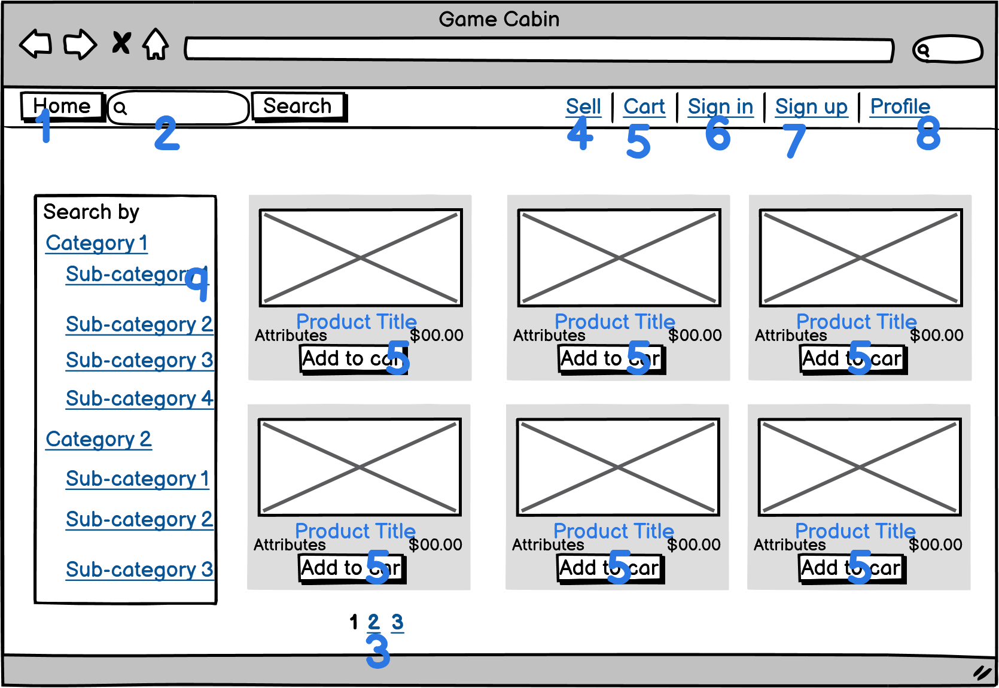

# Game Cabin

The master key is in docs folder
Completed as Term 2 Ruby on Rails assessment at [Coder Academy's](https://coderacademy.edu.au/) 2021 Fast track Bootcamp.

## Table of Contents
- [Game Cabin](#game-cabin)
  - [Table of Contents](#table-of-contents)
  - [Local environment for testing](#local-environment-for-testing)
  - [Problem Statement](#problem-statement)
  - [Important Links](#important-links)
  - [Description](#description)
    - [Purpose](#purpose)
    - [Functionality and Features](#functionality-and-features)
    - [Screenshots](#screenshots)
    - [Target Audience](#target-audience)
  - [Tech stack](#tech-stack)
  - [User Stories](#user-stories)
  - [Wireframes](#wireframes)
  - [ERD Diagram](#erd-diagram)
  - [Components](#components)
    - [User](#user)
    - [Category](#category)
    - [Product](#product)
    - [Shopping Cart](#shopping-cart)
    - [Address](#address)
    - [Order](#order)
    - [Third Party Services](#third-party-services)
## Local environment for testing

    
Click to expand

* clone repository with `git clone git@github.com:bennychen2004181026/marketplace_assignment.git`
* navigate into app folder with `cd src/game_cabin`
* update config/database.yml with your postgresql username and password.
* update config/credentials.yml with your variable AWS S3
* run `bundle install`
* run `sudo service postgresql start` or `sudo systemctl start postgresql`depending on the system
* run `rails db:setup`
* run `rails db:migrate`
* run `rails s`
* In a browser with typing `localhost:3000` to see the project.
* Game Cabin already been initialized with three default admin role account: "super@test.com", "test@test.com" and "test1@test.com". And their password are the same: "11111111". Please login the admin account to setup the product's categories and sub categories to be displayed in the homepage layout first.

## Problem Statement

* Identification of the problem you are trying to solve by building this particular marketplace app.

During the COVID-19 pandemic outbreak in Australia, Australian government closed the national border and people underwent strict lock down which eventually lasted several months. This intense lock-downs obviously facilitates the gaming spending when people has to stay at home for a long time. According to a analysis report , the gaming market potential is growing really fast as be anticipated to "surpass $5 billion by 2025".

As people purchased more and more game and relevant consoles for entertainment, a problem would eventually emerges. If they fed up with game content or they want a new gaming consoles, it not a smart way to leave the game case and consoles stacking at home with dust. On the other hand,  some game player want to buy some bargain game or consoles because the budget is limited.

* Why is it a problem that needs solving?

At this moment. A two sided marketplace app is excellent solution to meet both group’s need. As the gaming market grows, the player spend more money on game and consoles and it’s not financial sustainable to continue this behavior. Yet they would be wise enough to sell their own game or consoles if they don;t need them anymore. In contrast, the player whom like to spend less for more are looking for a place to buy some bargain. That’s what my  two sided marketplace app can offer. My app can provide a platform for the player to buy and sell pre-own game and consoles. Player can trade in lower price gaming items from other player. If player fed up with the items they bought from my app,they can sell the items in the app as well as a seller. So on and on, players can extract the value from the game and consoles to enjoy more gaming experience and make it cost-effective.

## Important Links

[Link to Github Repo](https://github.com/bennychen2004181026/marketplace_assignment)

[Link to deployed website](https://protected-plateau-22141.herokuapp.com/)

 [Back to Table of Contents](#table-of-contents)

## Description
    
### Purpose

The purpose of this app is to provide a two sided online marketplace platform for bargain preowned game and console selling and trading.

### Functionality and Features
  The following functionalities are provided in my app.
1. **User management**

    Basic user management is provided fro viewer to access to pages which require specific authorization. Any viewer whom doesn't login can view and search all the product, and even can add products to shopping cart. But selling product feature and processing to check out feature require viewer login as a user to continue.
    User can change password or log out when needed.
   
2. **Selling management**
   
    User can selling their own product in the selling product page. By providing the necessary details of the gaming item and send them to server and anyone else can see and search the items you sold. It requires user to provide items's image, the name, available status, amount, price and description. And in the selling page, user can edit or delete the items of their own while another simple user can not access to manipulate your items.

3. **Buying**
   
   The most important part of a marketing app is buying items. Users and even viewers can view and selecting items to shopping cart. Click the item picture can navigate to item detail page. Users and views can see the detail of each item and decide how many to order and even change the amount of whatever has been ordered. The shopping cart button leads to the page which displaying all the ordered items information and they can process to check out page from here. In the checkout page all the order information is displayed and a delivery address is required for delivery purpose. Unfortunately, I don't have enough time to implement the payment process.

4. **Searching**
   On my homepage, the left side is category classification. Everyone can click on the category that they want to explore and see the result immediately. The function is important for user to locate the kind of product they want and save time for user to find specific items among a lot of items. And the navigation bar on top can also provide searching function base on the name and category.

5. **Admin Management** 
   I also perform a admin interface for admin user to create, edit and delete the categories and products. Admin user has full access and manipulation to all products and categories.

- ### Sitemap

### Screenshots

1. **Home Page**

2. **Item Detail**

3. **Selling Page**

1. **Shopping Cart Page**

1. **Order Page**

### Target Audience

As the gaming market grows, more and more game player spend more money on game and consoles. Most players want to have excellent gaming experience with less spending, and some player want to sell their gaming item for money or they just need to focus on other business. And some player want to make more room at home because too much gaming items stacking at home. 

  ---

## Tech stack

    
Click here to expand

  **Frontend:**
  - HTML
  - CSS
  - Bootstrap
  - Font awesome

 **Backend**
  - Ruby 2.7.2
  - Ruby on Rails 6.0.4

 **Database**
  - Postgresql

 **Deployment**
  - Heroku

 **Utilities**
  - AWS S3 
   -- upload images

 **Tools**
  - Vscode
    -- Main coder editor
  - Github
  - diagrams.net
   -- create ERD
   -- create site map
  - Trello 
   -- tracking implement tasks
  - Balsamiq 
   -- create wireframes
   - Devise
   -- user authentication
   - Pundit
   -- user authorization

  
  
  
  ---

[Back to Table of Contents](#table-of-contents)

## User Stories

*  As a User, I need to be able to have my own account and can login, sign out and change password if I need.
*  As a User, I want to be able to search specific items that I am interested at.
*  As a User, I want to find the specific category of items that I might like in a short time.
*  As a User, I want to view the detail information of specific item.
*  As a User, I want to be able to add some items to shopping cart, even I am not log in yet.
*  As a User, I want to change the amount of items which I had put in my shopping cart.
*  As a User, I want to be able to delete the items I don't want to order anymore.
*  As a User, I want to see how much of the items I had order including total anticipated sending.
*  As a Seller, I want an sell my owned gaming items and can edit and deleted my stuffs.
*  As a Buyer, I want to provide an address for delivery purpose.
*  As a Admin user, I want full access to all the categories and items with manipulation.

## Wireframes

 [Back to Table of Contents](#table-of-contents)

## ERD Diagram

.png)

## Components

My game Cabin App is builded by using Ruby on Rails framework which address MVC design pattern.

As in a MVC design app, there are three most important high level components which are model, view and controller. 

The model represents the core date that my application is being used to access and manipulate. I view model as the heart of my app. The view and controller components assist user to interact with data entities model.

### User

    
Click here to expand

From the above user part database schema, there are so many attributes that are from Devise gem which help developer to manager functions and features on user model. From the names of the attributes we can guess what are the purposes with them, such an encrypted password is responsible for keep the password safe in database with encryption and all the different timestamp for different purpose, but that's not our concern because Devise help us manager this stuff including user controller and view part. The index below of email and reset_password_token means Devise need access to email to identify who is the user and reset_password_token to manager user password reset function. 

As a user, all I need to provide are email, password and password confirmation in the user sign in page. Devise will validate and sanitize the input for us.  As a developer, I just install the Devise and view and set the routing in routes.rb file to 'Devise for: users'. And I want to design a admin user which can have high authorization on manipulating other important data.

So I tried to add a 'role' attribute to divide the user into two different authorization group. Normal user role can sell and edit their own product as a seller. While admin can edit and change the whole categories and products data in a admin dashboard.

And I attached a user uuid as a unique identifier to user model. May be someone would ask why to do that because user model like all the other model, has a id already to identify itself. My answer is that because I want to implement a function of even user is not log in they can still click the add to shopping cart. At this moment the user record hadn't created so there is none user id to attach on the items that been order. So how to track down the items?

 I will initial a virtual user uuid by using before_action helper when viewer click the add to shopping cart button and store it in the browser cookies and session while cookies and session is a transient information storage for user. And this user uuid will attach to the shopping carts. 

If this viewer log in as a user, that means this viewer already has account in my app, then I can assign the real user uuid to the shopping cart that still exist in the browser and update the uuid in the session and cookies. If the user sign up as a new user, then I can assign the uuid which is stored in session to new user's uuid attribute. 

With this logic, I can perform this function and make the user uuid in async.

Good news is I successfully implement the uuid function, but bad new is the 'role' attribute is not working as I expect, which lead to that I can design admin user to access to admin dashboard. The whole thing is when I change the role attribute to 'admin'and  save it, there is none exception or error message show up and updated successfully like message instead. 

And then the weird thing happen, I find that the role attribute became nil without any manual manipulation and error message. 

It doesn't make sense and it trapped me for day. Search google and experiment with database for many time, and still don't find any clue. Consult with my educator with screen sharing and stay unsolved. It drive me crazy because time is ticking and only a couple of days left for the assignment due day. Finally I wasted too much time on this and unwillingly give up the planned payment feature and make the admin dashboard to be accessible to every user. After all, I have finished the admin dashboard first. 

From the above user model, we can see user has one address for postage purpose, when this user is deleted,then the address which belong to user will be deleted as well. User can has many shopping carts, orders and products, or don't has any of them as well as long as user doesn't click add item to shopping cart button, then user has nothing at that moment.
 
  
  
  ---
### Category

    
Click here to expand

Because in my design, product is an very important model in a marketplace app, and product belongs to category. And I have to introduce category part first.

From the above category schema, we can see category has attributes such as title as the name of category, weight as the factor to decide the displaying sequence according to the searching result or normal listing, and a ancestry attribute which comes from ancestry gem to track record in a node tree structure. With the help from ancestry gem and index of ancestry above, I can easily access and manager main categories node and sub categories node since they are parent and child like relationship between them. Index title can let the title be accessible when user need to search categories' name.

From category routes we can see when type the category endpoint with category id will past the id as param to the show action in the categories controller and the action will perform something base on the param and send back some records to the same action name html file in the categories folder under view folder by default. Optionally you can choose to send other format of respond such JavaScript file or json object, but in most scenario in my project, html is the default respond format that I need.

In the category controller, I only have a show action, after all category shouldn't be created or deleted by normal user. In this action, the param id will be past to the database query 'find', and according the 'Category'table records, the command will search and return the result and assign it to instance  variable '@category'. The 'get_categories_and_carts_num' method which I defined in upper application controller is for fetching whole categories records that the show html file needed. The product instance variable can be accessible due to the belong to relationship in product model.

In the show view, the html page receives the @category instance and their title attribute can be accessed and display. 'parent' is a helper from ancestry gem which can help to access the parent node of current node. Because category is the top node in the data tree, 'parent'method apply to category will throw an exception. Only past sub category id and all the product records that belongs this sub category will be displayed in this show page.

Consider I have to build up some real categories record in admin-dashboard, I need to validates all the input params that category only accepts. In the category model, it validates the title as string that needs to meet the presence, uniqueness and length requirements and relevant warning message to inform user what's wrong with the inputs and tell them what kind of standard of input is accepted. The weight as is displaying sequence impact factor which needs to be an integer within [1,100]. To apply the weight sequence on product, I need to define a method to fetch the tree nodes with the help of ancestry gem method 'roots' and 'children' and sort them base on weight as following.

Arrange all the category dates in an array, while the self.roots returns an array of first class categories and the array inject method will produces accumulating function base on the categories array. The empty array argument is the initial value which the 'result' represents, While the 'parent' presents every element in self.roots array which is first class category.

In the inject block, I declare a empty array to contain all the categories and then add all the sub categories array inside the array and after combine the initial empty row array it finally returns an array contains specific first class category in index 0 and corresponding sub categories array as the second element in index 2. And the this array goes in the initial result empty array box, and accumulate other array of category and its own sub categories. The result will look like this: [[C1,[c11,c12,c13...]],[C2,[c21,c22,c23...]],[C3,[c31,c32,c33...]]...] And the, I can invoke this handy method in what ever controllers action to get the main and sub categories record and loop through the result and send the result back to view.

While I need to create some categories records in admin dashboard, this category model is shared and extra actions and views are needed.

From above admin routing, we can see when user type different endpoint behind `http://localhost:3000/` with with get or put or delete requests, they will be redirected to the specific action within the relevant controller. For example when user type `http://localhost:3000/admin/categories` in the browser, the index action in categories controller under admin namespace will be invoked.

In the index action, if none of params input is attached, then it will consider user want to fetch all the categories record with the `.root` helper from ancestry. The root method will get all the button nodes' data in a tree data structure. In my app case, I use has categories and subcategories so all the sub ones will be gathered. If param integer is send in than, the method will query database with this integer id within Category table. And a specific main category record will be assigned to @category instance variable. At this moment, the data in @category is only about a main category and we need to invoke the `.children` helper from ancestry to fetch the sub category records under this main category and assign it back to @category again. Now I have the all sub categories data under specific category and with the `page` helper from a pagination gem `will_paginate`, the @category data will be send to `views/admin/categories/index.html.erb` file and being rendered in html syntax.

And the actual view will look like this:
You can see the end point in the url is just categories and without any params and as I mentioned above this page receives only main categories data. Then look at the content, `Console` and `Game` are exactly the categories. And then when I type with `/categories?id=2`, the page turns out like this:The question marks with subsequent `id=2 means I want to query all the records under id 2 category which is game. And yet check the content in the middle of the page and yes, that's what I need.

Just like all the other action in on matter categories or products controller, when user want to communicate with database in rails, they need to send different endpoint within url, and the routes file will identify if the url endpoint exists , if exists, then route will be directed to the matching action in relevant controller.
 
  
  
  ---
### Product

    
Click here to expand

And then I goes to the product part which is belongs to category and has a category id as a foreign key. Which means I 

In this schema, we can see there are a lot of necessary attributes to identify and depict the gaming item for sale. Title represents the name. Status represents the current item availability. When it's set to 'not available' for whatever reason, the item won't appear on the page. The amount, price and description are the essential attributes that a product has.

The uuid is a unique identifier for itself attaching on a invoice to keep tracking of this product. The user_uuid assists implementing the user authorization with the help form pundit. In my app, the main purpose is products all the user can create a new product. But update, edit or delete function of specific item only apply to the owner or admin. By attaching the user_uuid to product I can track who is the owner of this item. With the help from Pundit gem which focus on user authorization, I can write some short-circuit evaluation in product policy file to determine if the user is admin or the item owner.
.
In the three action update, edit and destroy which need authorization to process, the short-circuit evaluates if the current user is admin user. If yes, then doesn't need to evaluation the right side and evaluates to true immediately, If not, then it will evaluate the right side by comparing the product’s attached user identifier with current user’s identifier. 

And then by applying the `authorize @product` in the action, Pundit will help invoke the relevant name method in that model policy file. 

While I finish the product data constraints in the schema then I have to define the front end input validations of product attribute to keep front end and database constraints in sync. Here are my product inputs validations.

And I need to identify the product relation with another model.

The product belongs to category so it require a category exists first then can be created with the belongs to relationship.

One product has one shopping cart. In my app, one shopping cart only contain one specific item no matter how many of this items inside. Such as a user click three different products then the user has 3 shopping carts.

When one product is initialized, the user_id is required and be attached to this product. So it belongs to one user at the begging.

One product has one attached image with the help from active storage which managing the assets storage with model in database.

The has_one_attached sets up a one-to-one mapping between records and the image I had upload. Because in my app, only product model requires assets storage, therefore the record_id attribute in active storage attachments table map with each product id. Abd attachments table associate with blob table where actually store the image file by index blob_id.

Just like shopping cart, one product has one order.

On the home page, I have a searching button which provides searching feature for user to spot the items that they want efficiently. 

In the SQL query the `like` operator is used in a `WHERE` clause to search for a specified pattern in a column.
The `%` represents zero, one, or multiple characters. Therefore, when user type some word in the searching bar, the params will be send to the `params[:w]`block, and the like operator will search all the title that has this specific character piece in the title. The second searching bar can search all the items that under the same category
 
  
  
  ---

### Shopping Cart

    
Click here to expand

From the shopping cart schema we can see the user_id attribute can be null while one shopping cart record is created. Because I need a changeable user identifier to keep track of the owner of this cart record. Obviously I can rewrite the user_id, therefore a changeable user_uuid is needed if I want to implement a task when a viewer doesn't log in and still can click the product to add to a shopping cart and after the viewer log in or sign up, the shopping cart is still trackable and build relationship.

One shopping cart belongs to one user or a virtual user by assigning a virtual uuid.

One shopping cart requires a specific product exists and belongs to te when it's created.

Product id and amount are the essential attributes which represent what it is and how many of the item in the shopping cart model.

Ok then let me explain the process of clicking an 'Add to cart' button on homepage and what is behind the scene. 

When this button is click, it actually pass that product record as a argument into a helper method as following:

The helper method `show_add_to_cart` receives a product instant and/or a hash argument which contain a css class to change styling. The product id is extracted from the product record as an identifier and being paired with a class clause. This key value pair will be send to `shopping_carts_path`. And at the same time, because the 'add-to-cart-btn' class as a DOM node is already attached to this link, hence the link clicking action will activate a JavaStript event listener to perform some task.

In the JavaScript function, when some click on the button with `.add-to-cart-btn` class then the block inside will be run. `$prog = $this.find('i');` is for spotting the font awesome icon because font awesome icon has `i` in the class. The `$amount = $('input[name="amount"]')` is used on single product detail page and we don't have this amount input on the home page which is fine, we will implement some logic later to determine the amount. With `parseInt($amount.val())` we can turn any weird input that couldn't be read as integer into 0. In the ajax block the `shopping_carts_path` is populated into a href link in html, the method is Post, and the product id and the empty amount variable will be packed as data and post to the `shopping_carts_path`link. Because ajax is asynchronous javaScript which can running thread asynchronously, before send the data to that path, a little spinning icon will be invoked and start spinning. At the same time the data will be send attached with this request. According the shopping carts routes as below,
 `post '/shopping_carts', to: 'shopping_carts#create'` this route will invoke the create action in shopping cart controller and the action will receive the data which is attached within the body of request.

In this action, we need to determine the amount variable. If the add to cart button is clicked on the home page, then is nil, if the button is clicked on the single product display page, then the amount could be an valid integer or 0 via the `parseInt`function in ajax before. At this moment we can apply a ternary operation to determine the amount variable, if it's less or equal to 0 then assign 1 to the variable, if it's a valid positive integer then stay the same. Then send three necessary attributes into a helper defined in my shopping cart model. 
In this helper, I tend to find in the database that if the same kind of cart exists, if exists then it means I already add this kind of item before, what I can do is updating the amount of this item in a shopping cart. If I can find any record base on the product id and user uuid index, then it means this product is new in the shopping cart, then create a new one. And finally return the single product record to create action and create action send the record to the view file in `view/shopping carts/create.html.erb`. I nearly forgot the ajax, actually it still got some task to perform. It's look for a bootstrap modal div with id `#shopping_cart_modal` tag and pop up the modal window. And the create.html.erb file is luckily with that div and it meets bootstrap modal pop up standard. So a nice pop up window will show up.

After that, we can click on the shopping cart button in the navigation bar. Base on the route `get '/shopping_carts', to: 'shopping_carts#index', as: 'shopping_carts'`, the app will try to invoke the index action in shopping carts controller. In the index action, 
all the carts records which belongs to current user uuid stored in the session will be fetched and plus the product image. All the record and images will be send to index view html file in the shopping carts view folder.

 
  
  
  ---

### Address

    
Click here to expand

In my checkout part, a address for delivery is required. In the check out page, I am going to ask user for valid address information to finish the process. Name, phone, address postcode are necessary and required in a e-commercial trading environment. 

Because we are dealing with massive amount of input, consequently we need to define detailed validation on these inputs. 

One user has one address, and one address belongs to one user. It's a one to one relationship in my app. One address has many orders means the address can be attached to many orders.

On the checkout page, when a user click on the build new address button, rails will try to find the route with `new_address_path`  Then rails find the matching route with the action new in address controller and try to run the code in new action block. 

Because address belongs to one user and one user has an address, this association can use `build_XXX` to build new object base on their relationship. Therefor a new address record with current user's id will be create and being send to the new.html view file and render. 
On the render page, user need to fill with all the required information to form a valid address record. The validation rule is attached above in the address model. When user make incorrect input, the notice message in flash will inform user what format of information is needed. 

After all the inputs are valid and user click on the save button at the bottom, rails will try to find the matching route in routes.rb.

The logic in the font end will determine what kind of request is going to send base on this address is new record or not.If it's a new record, then all the params will post to address_path to create a new one, if it's not a new record, then it will use put request to send the whole rew address record to address_path to update the old one. 

In the post to address_path route, the create action in address controller will be perform. It accepts the sanitized
params and apply the `build_address` method again to create a new address record.

Becaus one user only has one address, hence when we click the build new address button, the logic result will change because the address is not a new record now. The the route will put the record to address_path and invoke update action in address controller.

  
  
---

### Order

    
Click here to expand

In my order schema, order model try to gather all the necessary information toward checkout path, the user id, product id, address, amount and total payment are required to make it legitimate to pay.

One order belongs to one user, one product and one address, meaning that if I want to create a new order, I need to login as a user and an address already attached to my account and also I have at least one product in the shopping cart. As a result this new order page has to be logged in and provide address first.

In the render page, by fetching all the user owned shopping carts by session user uuid and the only address record plus the product image. All the required data is ready and can send to the real payment page. Unfortunately, I don't have enough time to implement this. The weird user role attribute hold me back for days. I will try to implement this afterward.

  
  
---

### Third Party Services

* Trello
Trello is a project management system that employs Kanban boards, cards, and lists to manager projects, tasks and help tracking of the project progression. User can organize their resource materials in real-time. As with Kanban, user can manager several projects effectively by applying visual ticklers. You can check the project progress among group members.

* Github
Github is a code hosting platform for version control and teamwork. GitHub is the best place to share code with friends, partners, and even strangers. 

* PostgreSQL
PostgreSQL is an open source database management system. SQL and JSON for relational and non-relational queries are supported by PostgreSQL and it supports advanced data types as well.

* Heroku
Heroku is a fully-managed platform that provide easy path to deploy apps effectively. It enables developers to build, operate applications in the cloud environment.

* Amazon Web Services
Amazon Web Services is a cloud service provider that offers various compute power, database storage, content delivery and services that are accessible over the public. As in my app, AWS is used to uphold our image assets and keep the image available to any visitors who visit my app.

* Draw io
Draw.io is open-sourced diagram and flowchart software. If I need to draw sitemap, Entity Relationship Diagram, flow chart or any other diagram design, Draw.io will be my first option.

* Balsamiq
Balsamiq wireframes design software that enables users to work together on making mockups and manager versions control.If my assignments requires designing wireframes of app, then Balsamiq would be a good choice.
